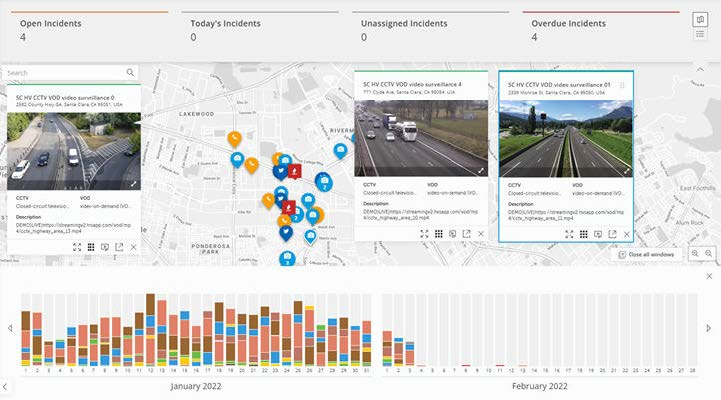
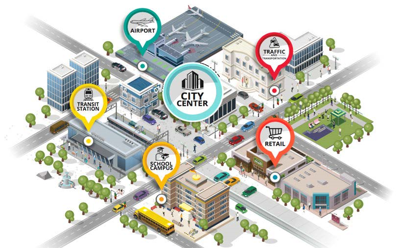

# HVS User guide
The guide describes the features of Hitachi Visualization Suite and provides step-by-step
instructions for using it.

## Overview
Hitachi Visualization Suite is a state-of-the-art software solution that provides geospatial
mapping of data from multiple sources to provide operational insights. Visualization Suite
provides comprehensive integration capabilities with video and data devices, analytics, and
private entities. The integrated event data is visualized over the map for easy access to realtime
data.
Visualization Suite integrates with all major law enforcement systems, including third-party
video management systems, computer-aided dispatch (CAD) or 911 systems, license plate
readers, gun-shot detection, and third-party sensors. This solution benefits both public safety
officials and private entities.

## Geospatial visualization of data from multiple sources
In today’s digitized world, both public and private organizations must analyze a large amount
of data coming from a multitude of sources. For these organizations, accessing, correlating,
and analyzing the data can be a challenging task. Visualization Suite provides a “single pane
of glass” for geospatial visualization to gain the situational awareness required to better
respond to problems or even prevent them from occurring. 

## Cloud and on-premises solutions

Visualization Suite offers multiple deployment options. You can use Visualization Suite as
software as a service (SaaS), software deployed on premises, or hybrid to match your IT
infrastructure strategy.

## Video surveillance interoperability

The Visualization Suite video connectors allow you to integrate with the existing video
management systems (VMSs) and Hitachi Video Management Software (HVMS), which gives
a comprehensive, all-in-one solution that simplifies video system deployment and
management.

## Intelligent inspections

Hitachi Intelligent Infrastructure Monitoring (HIIM) solution helps in remote inspection and
monitoring of infrastructures. HIIM includes thermal and visual spectrum cameras, rugged
computers, edge and cloud applications, video and data analytics, and HVS inspection
engine service.
The HIIM solution is integrated with HVS using the Inspection Automation feature.
HIIM automates remote monitoring tasks, including temperature tracking, digital and analog
gauge readings, and overall health. It ensures that critical components function optimally and
within normal operating ranges. This real-time monitoring helps identify potential issues
before they escalate into major problems, thereby minimizing downtime and enhancing
infrastructure safety and efficiency. For more information, see Administer intelligent inspections.

## Incident management and Standard Operating Procedure (SOP)

An incident is an event that is unplanned and can adversely affect an organization and its
business. For example, flooding of a building, fire accident, or system failure.
Incident management in Visualization Suite enables you to create a process that can help in
restoring the normalcy within the designated SLA and, thereby minimize the impact on the
business operations.
You can classify incidents into the right incident type and manage incidents based on the
assigned priority, severity, and SOPs. See Manage incidents (on page 91) for more
information.
Visualization Suite allows you to create SOPs or guided responses for every incident type.
These step-by-step instructions help workers responsible for incident management to carry
out the routine operations while following the necessary protocols. SOPs helps to achieve
efficiency and uniformity in performance, while reducing miscommunication. See Standard
Operating Procedure for more information.

## Dashboards

The Dashboard feature provides visualization of historical event data and allows you to
analyze event statistics. A custom dashboard add-on (available in release 6.0.0) extends the
native analytics capability of Visualization Suite by allowing organizations to leverage
Pentaho, Hitachi's industry-leading business intelligence software, to generate and publish
custom reports to Visualization Suite. See Overview of Basic and Custom Dashboards for
more information.

## Entity management

Organizations rely on a variety of data from disparate sources in real time to improve
situational awareness. Visualization Suite lets you tailor geospatial mapping of different types
of data, or entities. For example, you might want to view gunshots only within the past 12
hours, instead of all gunshots that have ever been reported. On the other hand, stationary
entities, such as buildings and cameras, are persistently visualized as they provide important
data points to improve situational awareness.

## Data integration

Visualization Suite integrates data from multiple sources, including analytics applications and
sensors. The majority of events are ingested data that is aggregated automatically in
Visualization Suite, eliminating the need for manual entry of each event. Events such as
computer aided dispatch (CAD) events coming directly from 911 calls, gunshot detections
coming from directory sensors, license plate recognitions, and social media events are
immediately available from the map view.

## Data mapping

Using the Data Mapping feature, HVS can seamlessly integrate with IoT sensors and process
real-time data from various sources. For example, external sensors that detect alerts can
transmit their data to the HVS ETL engine using either the HTTPS or MQTT protocol.

The source data is then translated into HVS data using a data map created by the
administrator, eliminating the need for a dedicated connector. This enables external IoT
devices to send their data to HVS in real-time. This flexibility helps administrators to make
data available on HVS independently.

## Slew to cue

The automated workflows, "slew to cue," enable a sequence of actions triggered by an event.
For instance, in the event of a gunshot, HVS can quickly locate the nearest camera, direct it
to the scene, bookmark the event, and send a list of nearby cameras to the field responder.
When the responder logs into the system, the camera is already focused on the incident
scene, eliminating the manual process of finding and moving the camera. With one click,
responders can play back the scene from 10 seconds prior. This feature is crucial in urgent
situations where every second counts, allowing responders to act swiftly and effectively.
Additionally, the bookmark feature enables investigators to identify and analyze the event
later.

## Advanced configurable workflow

Advanced configurable workflow helps HVS administrators to build custom conditions and
select actions triggered by HVS entities. Each organization has unique assets and situations
to manage, whether it is responding to gunshots, detecting intruders, or monitoring data
anomalies during inspections.
The highly configurable workflow accommodates these differences, enabling administrators
to create conditions tailored to their specific needs. Administrators can use 'and' or 'or'
conditions and group by expressions to build and execute actions when conditions are met.
This automation streamlines processes and saves time compared to manual methods. For
example, an operator will be notified when a gas meter anomaly is identified, a field
responder will be alerted when a gunshot is detected, or an HVS entity will be pushed to an
external system when emergency events are detected.

## Identity management

Hitachi Visualization Suite users are now managed by a common identity management
service that enables single-sign on across other Hitachi applications. In addition, this service
enables integration with the customer’s active directory service. The existing HVS user
management service is still used for service accounts for third party system integrations.

## Role-based user permissions

HVS role-based permissions are highly configurable. You can use groups to associate users
by organization and control their access to specific entities and actions within HVS domain.
For example, a police department group can have cameras located within their district, with
no visibility outside of that area. Some officers might have live viewing capabilities, while
investigator officers might only have playback access to view past incidents. Field responders
might have access to car accident scenes, while operators within a building might have
visibility over building management assets and events, such as stolen cards or broken doors.
This allows each operator to focus on their specific responsibilities. To set this up, you first
define rules that specify the level of access users will have to various entities, and then
assign these rules to each group.

## Timeline feature

The Timeline feature can be used to view historical data. Using Timeline, you can go back
and view a snapshot of entities (events, inspections, incidents) for a specific time of day.
Timeline also gives easy access to archived footage and event data, enabling you to view
scenes for a specific time around the event. See View entity timelines.

## Search capabilities

Visualization Suite allows you to search for particular events and objects by setting a search
area. For example, you can look for all burglaries and CAD calls for the last three days within
the city limit. Results that match these criteria are displayed on the map view and the list
view. For details, see Use search.

## Language options

The HVS user interface is designed to be globally accessible, offering support for multiple
languages. This ensures that users from diverse linguistic backgrounds can easily navigate
and utilize the software. For more information about how to select your preferred language,
see User preferences.

## Security

Visualization Suite is designed with advanced security features to ensure the safety and
security of the sensitive data. Because the data processed by the visualization system can be
classified, all data going from the client network to Visualization Suite is unidirectional. Traffic
going from behind the client secure network to the encrypted HVS Cloud Services is secured
through Hitachi Vantara LLC Visualization Platform (HVP). See Security overview for details.

## Gateways

Hitachi Vantara LLC Edge Gateway for Video is an intelligent edge device that integrates
third-party video systems and performs transcoding for optimal cloud livestreaming and
recording. Edge Gateway for Video also acts as a data ingestion service for external sensor
data. Depending on the number of simultaneous livestreams anticipated from the source
systems, several gateway options are available. A gateway combined with the Visualization
Suite software enables a seamless integration into private-entity security assets.
For details about the Visualization Suite video gateway, see the Installation Guide using the
OVF templates.

## End-to-end IoT solution for smart cities

As one of the Hitachi's Smart Spaces and Video Intelligence solution offerings, Visualization
Suite gives end-to-end, adaptable, and intelligent solutions for smart cities. These solutions
use integration of big data, including video feeds, event data, and social media, to give realtime
analytics that public safety officials can act on.

All solution components in the Smart Spaces and Video Intelligence solution stack are
modular, functioning as building blocks for smart cities. They help all areas and organizations
become safer and more effective, so they can thrive. The following video intelligence
solutions are available for integration with Visualization Suite or for standalone deployment:

- Hitachi Video Analytics (HVA)
- Hitachi Video Management Software (HVMS)
- Hitachi Video Management Software Base (HVMS Base)